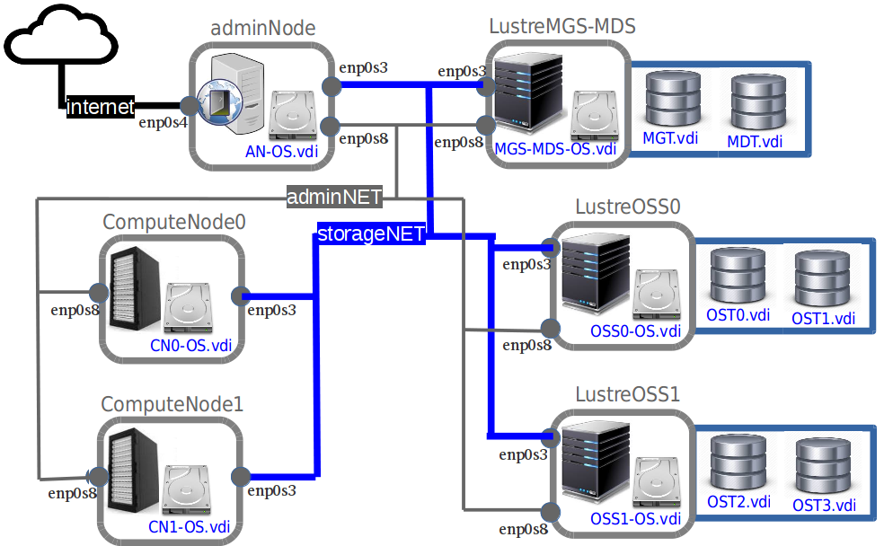

# Create a virtual cluster using VBox

## Virtual Cluster Architecture



### Virtual Machines

* LustreMGS-MDS: 3 storage devices (LustreMGS-MDS,MGT,MDT), 2 network interfaces ('storageNET', 'adminNET')
* LustreOSS0: 3 storage devs (LustreOSS0,OST0,OST1), 2 network ifs ('storageNET', 'adminNET')
* LustreOSS1: 3 storage devs (LustreOSS1,OST2,OST3), 2 network ifs ('storageNET', 'adminNET')
* ComputeNode0: 1 storage dev (ComputeNode0), 2 network ifs ('storageNET', 'adminNET')
* ComputeNode1: 1 storage dev (ComputeNode1), 2 network ifs ('storageNET', 'adminNET')
* FrontNode-NFS: 1 storage dev (FrontNode-NFS), 3 network ifs ('storageNET', 'adminNET', NAT)

Here is an example of `LustreMGS-MDS` virtual machine configuration file.

```
<?xml version="1.0"?>
<!--
** DO NOT EDIT THIS FILE.
** If you make changes to this file while any VirtualBox related application
** is running, your changes will be overwritten later, without taking effect.
** Use VBoxManage or the VirtualBox Manager GUI to make changes.
-->
<VirtualBox xmlns="http://www.virtualbox.org/" version="1.16-linux">
  <Machine uuid="{e2089d38-69c3-4ad0-bf0b-d33d0719fd72}" name="LustreMSG-MDS" OSType="RedHat_64" stateFile="Snapshots/2017-12-27T15-41-13-318024000Z.sav" currentSnapshot="{6ee36c69-d37d-4d38-a2ee-4585b012410a}" snapshotFolder="Snapshots" currentStateModified="false" lastStateChange="2017-12-27T17:47:06Z">
    <MediaRegistry>
      <HardDisks>
        <HardDisk uuid="{0f8f5bdc-d42d-40d6-a17b-4c3cd522760f}" location="LustreMSG-MDS.vdi" format="VDI" type="Normal">
          <HardDisk uuid="{efb50cda-2831-4b42-b55a-cb7aeec6cca9}" location="Snapshots/{efb50cda-2831-4b42-b55a-cb7aeec6cca9}.vdi" format="VDI"/>
        </HardDisk>
        <HardDisk uuid="{7c6974ff-5e2d-4bc8-8ee5-240d670e3809}" location="MGT.vdi" format="VDI" type="Normal">
          <HardDisk uuid="{ced1d17e-c2bc-493e-b0c4-7869bf91a6d1}" location="Snapshots/{ced1d17e-c2bc-493e-b0c4-7869bf91a6d1}.vdi" format="VDI"/>
        </HardDisk>
        <HardDisk uuid="{3e691d95-a718-4fd8-a10c-dd6cc46a480b}" location="MDT.vdi" format="VDI" type="Normal">
          <HardDisk uuid="{c9aaa166-228e-4b17-a7b8-fa3d68778c49}" location="Snapshots/{c9aaa166-228e-4b17-a7b8-fa3d68778c49}.vdi" format="VDI"/>
        </HardDisk>
      </HardDisks>
      <DVDImages>
        <Image uuid="{5439aae4-9449-4402-83b5-2ba8999f06ef}" location="/home/devdz/CentOS-7-x86_64-Minimal-1708/CentOS-7-x86_64-Minimal-1708.iso"/>
      </DVDImages>
    </MediaRegistry>
    <ExtraData>
      <ExtraDataItem name="GUI/LastCloseAction" value="SaveState"/>
      <ExtraDataItem name="GUI/LastNormalWindowPosition" value="835,48,720,446"/>
    </ExtraData>
    <Snapshot uuid="{6ee36c69-d37d-4d38-a2ee-4585b012410a}" name="Linked Base for LustreMSG-MDS and LustreMSG-MDS-bis" timeStamp="2017-12-27T17:47:05Z" stateFile="Snapshots/2017-12-27T15-41-13-318024000Z.sav">
      <Hardware>
        <CPU count="2">
          <PAE enabled="true"/>
          <LongMode enabled="true"/>
          <X2APIC enabled="true"/>
          <HardwareVirtExLargePages enabled="false"/>
        </CPU>
        <Memory RAMSize="512"/>
        <Display VRAMSize="16"/>
        <VideoCapture fps="25" options="ac_enabled=false"/>
        <BIOS>
          <IOAPIC enabled="true"/>
        </BIOS>
        <USB>
          <Controllers>
            <Controller name="OHCI" type="OHCI"/>
          </Controllers>
        </USB>
        <Network>
          <Adapter slot="0" enabled="true" MACAddress="08002704531E" type="82540EM">
            <DisabledModes>
              <HostOnlyInterface name="vboxnet1"/>
              <NATNetwork name="NatNetwork"/>
            </DisabledModes>
            <InternalNetwork name="storageNET"/>
          </Adapter>
          <Adapter slot="1" MACAddress="080027C22FC0" type="82540EM">
            <DisabledModes>
              <InternalNetwork name="intnet"/>
              <NATNetwork name="NatNetwork"/>
            </DisabledModes>
            <HostOnlyInterface name="vboxnet1"/>
          </Adapter>
        </Network>
        <AudioAdapter codec="AD1980" driver="Pulse" enabled="true" enabledIn="false"/>
        <RTC localOrUTC="UTC"/>
        <GuestProperties>
          <GuestProperty name="/VirtualBox/HostInfo/GUI/LanguageID" value="en_US" timestamp="1514389273312942000" flags=""/>
        </GuestProperties>
      </Hardware>
      <StorageControllers>
        <StorageController name="IDE" type="PIIX4" PortCount="2" useHostIOCache="true" Bootable="true">
          <AttachedDevice passthrough="false" type="DVD" hotpluggable="false" port="1" device="0"/>
        </StorageController>
        <StorageController name="SATA" type="AHCI" PortCount="3" useHostIOCache="false" Bootable="true" IDE0MasterEmulationPort="0" IDE0SlaveEmulationPort="1" IDE1MasterEmulationPort="2" IDE1SlaveEmulationPort="3">
          <AttachedDevice type="HardDisk" hotpluggable="false" port="0" device="0">
            <Image uuid="{0f8f5bdc-d42d-40d6-a17b-4c3cd522760f}"/>
          </AttachedDevice>
          <AttachedDevice type="HardDisk" hotpluggable="false" port="1" device="0">
            <Image uuid="{7c6974ff-5e2d-4bc8-8ee5-240d670e3809}"/>
          </AttachedDevice>
          <AttachedDevice type="HardDisk" hotpluggable="false" port="2" device="0">
            <Image uuid="{3e691d95-a718-4fd8-a10c-dd6cc46a480b}"/>
          </AttachedDevice>
        </StorageController>
      </StorageControllers>
    </Snapshot>
    <Hardware>
      <CPU count="2">
        <PAE enabled="true"/>
        <LongMode enabled="true"/>
        <X2APIC enabled="true"/>
        <HardwareVirtExLargePages enabled="false"/>
      </CPU>
      <Memory RAMSize="512"/>
      <Display VRAMSize="16"/>
      <VideoCapture fps="25" options="ac_enabled=false"/>
      <BIOS>
        <IOAPIC enabled="true"/>
      </BIOS>
      <USB>
        <Controllers>
          <Controller name="OHCI" type="OHCI"/>
        </Controllers>
      </USB>
      <Network>
        <Adapter slot="0" enabled="true" MACAddress="08002704531E" type="82540EM">
          <DisabledModes>
            <HostOnlyInterface name="vboxnet1"/>
            <NATNetwork name="NatNetwork"/>
          </DisabledModes>
          <InternalNetwork name="storageNET"/>
        </Adapter>
        <Adapter slot="1" MACAddress="080027C22FC0" type="82540EM">
          <DisabledModes>
            <InternalNetwork name="intnet"/>
            <NATNetwork name="NatNetwork"/>
          </DisabledModes>
          <HostOnlyInterface name="vboxnet1"/>
        </Adapter>
      </Network>
      <AudioAdapter codec="AD1980" driver="Pulse" enabled="true" enabledIn="false"/>
      <RTC localOrUTC="UTC"/>
      <GuestProperties>
        <GuestProperty name="/VirtualBox/HostInfo/GUI/LanguageID" value="en_US" timestamp="1514389273312942000" flags=""/>
      </GuestProperties>
    </Hardware>
    <StorageControllers>
      <StorageController name="IDE" type="PIIX4" PortCount="2" useHostIOCache="true" Bootable="true">
        <AttachedDevice passthrough="false" type="DVD" hotpluggable="false" port="1" device="0"/>
      </StorageController>
      <StorageController name="SATA" type="AHCI" PortCount="3" useHostIOCache="false" Bootable="true" IDE0MasterEmulationPort="0" IDE0SlaveEmulationPort="1" IDE1MasterEmulationPort="2" IDE1SlaveEmulationPort="3">
        <AttachedDevice type="HardDisk" hotpluggable="false" port="0" device="0">
          <Image uuid="{efb50cda-2831-4b42-b55a-cb7aeec6cca9}"/>
        </AttachedDevice>
        <AttachedDevice type="HardDisk" hotpluggable="false" port="1" device="0">
          <Image uuid="{ced1d17e-c2bc-493e-b0c4-7869bf91a6d1}"/>
        </AttachedDevice>
        <AttachedDevice type="HardDisk" hotpluggable="false" port="2" device="0">
          <Image uuid="{c9aaa166-228e-4b17-a7b8-fa3d68778c49}"/>
        </AttachedDevice>
      </StorageController>
    </StorageControllers>
    <Groups>
      <Group name="/LITIO Lustre"/>
    </Groups>
  </Machine>
</VirtualBox>
```

### Virtual Networks

* ('storageNET',Internal Network): storage dedicated network
* ('adminNET',Internal Network): administration and internet access dedicated network
* NAT: bridged network for internet access from Host

### Virtual Storage devices

* LustreMGS-MDS, LustreOSS0, LustreOSS1, ComputeNode0, ComputeNode1, FrontNode-NFS: 4GB VDI each
* MGT, MDT: 8GB VDI each
* OST0, OST1, OST2, OST3: 16GB VDI each
